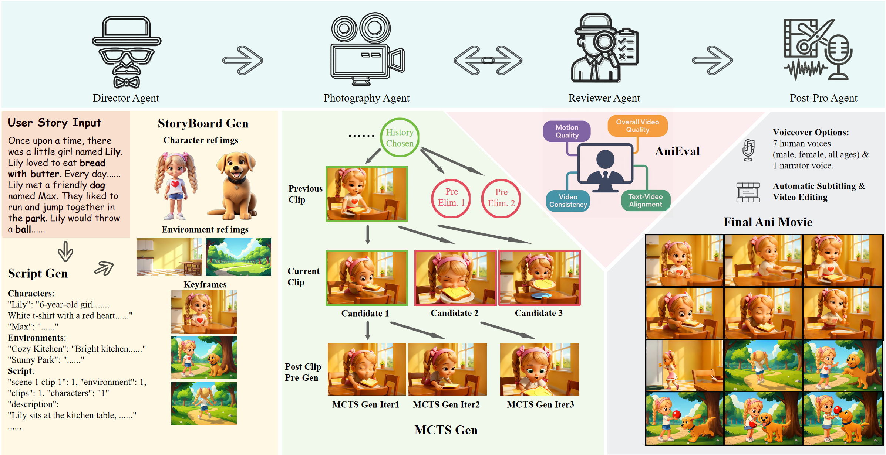
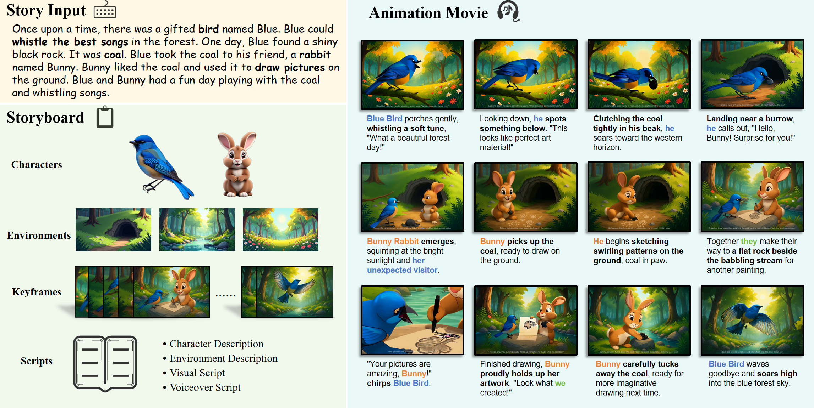

<div align="center">

<h2><a href="https://arxiv.org/abs/2506.10540" target="_blank">AniMaker: Multi-Agent Animated Storytelling with MCTS-Driven Clip Generation</a></h2>
 <b> SIGGRAPH Asia 2025 </b>

_**[Haoyuan Shi](https://github.com/HaoyuanShi), [Yunxin Li](https://yunxinli.github.io), Xinyu Chen, Longyue Wang, Baotian Hu*, and Min Zhang**_
  
(* Corresponding Authors)

Harbin Institute of Technology, Shenzhen

Alibaba International Group

🚀 Welcome to the repo of **AniMaker**.

If you appreciate our project, please consider giving us a star ⭐ on GitHub to stay updated with the latest developments.  </h2>
 
</div>


<!-- ## 💥 News

- `2025/6/13`: 🎬 We release the paper of the newest version of Anim-Director, named [AniMaker](https://arxiv.org/pdf/2506.10540). The codes and evaluation framework will be released soon.

- `2025/4/24`: 🎬 Our upgraded pipeline is nearly ready! Witness the magic as it transforms a few simple words into a complete animated short film ***Girl & Cat*** with zero human intervention! Click the image below to watch the film! 👇  
  <a href="https://www.youtube.com/watch?v=O8XLR1GdFUo" target="_blank">
    
  </a>

- `2025/2/21`: 🎬 We are in the process of completely updating our pipeline based on Vidu 2.0. Here is an animation sample featuring ***The Little Prince***. Click the image below to watch the video! 👇  
  <a href="https://www.youtube.com/watch?v=txj6GmYGBJw" target="_blank">
    
  </a> -->

  
## 🎏 Overview

<p align="center">  </p>

**AniMaker is a multi-agent framework designed to generate coherent, long-form storytelling animations from text.** 

Unlike traditional methods that produce rigid and disjointed clips, AniMaker enables multi-candidate generation, intelligent clip selection, and global story-level consistency. It integrates specialized agents and novel evaluation strategies, achieving superior quality and efficiency compared to existing video generation approaches.

Workflow

· Director Agent: Generates the storyboard from the input text, defining multi-scene and multi-character narratives.

· Photography Agent: Uses MCTS-Gen, an MCTS-inspired strategy, to efficiently generate multiple candidate clips and select high-potential ones.

· Reviewer Agent: Employs AniEval, the first evaluation framework for multi-shot animation, to assess story-level consistency, action completion, and animation features across clips.

· Post-Production Agent: Edits the final sequence, ensures smooth transitions, and adds voiceovers for a production-quality output.


## 🌈 Visualization

<p align="center">  </p>
<!-- final decision后 这里加一个ytb链接，把做的sig asia demo放上去 -->

We have recorded a video to introduce our work. Click the image below to watch the video! 👇  

<p align="center">
  <a href="https://www.youtube.com/watch?v=hWflnJobPfQ" target="_blank">
    
  </a>
</p>


## 🎨 Comparison 
<div align="center">
  <table>
    <tr>
      <td style="text-align:center;"><b>MovieAgent</b></td>
      <td style="text-align:center;"><b>MM-Story</b></td>
      <td style="text-align:center;"><b>VideoGenoT</b></td>
      <td style="text-align:center;"><b>AniMaker(Ours)</b></td>
    </tr>
    <tr>
      <td><video src="https://github.com/user-attachments/assets/b34de38c-fe8b-49f0-b591-aaefa27a9d30" controls width="200" height="100"></video></td>
      <td><video src="https://github.com/user-attachments/assets/ada4a98c-2eb7-4f36-a941-c5ac6f4e1056" controls width="200" height="100"></video></td>
      <td><video src="https://github.com/user-attachments/assets/3de195b1-043e-46b8-a861-5aa0b9ae0c47" controls width="200" height="100"></video></td>
      <td><video src="https://github.com/user-attachments/assets/b215bc74-2d3b-45cf-9559-b1eb242612f5" controls width="200" height="100"></video></td>
    </tr>
    <tr>
      <td><video src="https://github.com/user-attachments/assets/506fdc35-696d-453c-9774-2a1b577a986c" controls width="200" height="100"></video></td>
      <td><video src="https://github.com/user-attachments/assets/f0867e71-959d-4b77-a7a8-07b0ec2ff80c" controls width="200" height="100"></video></td>
      <td><video src="https://github.com/user-attachments/assets/2a7d064f-6a63-4d66-a069-50586e48bfc8" controls width="200" height="100"></video></td>
      <td><video src="https://github.com/user-attachments/assets/cf27549c-a3cb-4672-a37b-1bec0f5cc5b8" controls width="200" height="100"></video></td>
    </tr>
  </table>
</div>

Due to video size limitations, compressed versions are shown here. Original high-resolution videos can be found in the assets directory.

## ⚡️ Usage

<details>
  <summary><h3>Prepare Environment</h3></summary>

```bash
conda create -n AniMaker python==3.9
conda activate AniMaker
pip install torch==2.4.0 torchvision==0.19.0 torchaudio==2.4.0 --index-url https://download.pytorch.org/whl/cu124
pip install pybind11
pip install -r requirements.txt
# install google-genai
pip install google-genai==1.5.0
# install groundingdino
cd Benchmark/EvalCrafter/metrics/Segment-and-Track-Anything/src/groundingdino
pip install -r requirements.txt
pip install -e .
cd ../../../../../../
# install nvdiffrast
pip3 install git+https://github.com/NVlabs/nvdiffrast
# install mmcv
pip install mmcv==2.2.0
## solve version conflict issues
sed -i "s/mmcv_maximum_version = '2.1.0'/mmcv_maximum_version = '2.2.1'/" /home/user/anaconda3/envs/AniMaker/lib/python3.9/site-packages/mmaction/__init__.py
sed -i "s/mmcv_maximum_version = '2.1.0'/mmcv_maximum_version = '2.2.1'/" /home/user/anaconda3/envs/AniMaker/lib/python3.9/site-packages/mmdet/__init__.py
# install pyiqa
pip install pyiqa==0.1.13
pip install transformers==4.47.0
# install pytorch3d(0.7.8)
pip install git+https://github.com/facebookresearch/pytorch3d@stable
# install resample2d-cuda(0.0.0)
cd Benchmark/EvalCrafter/metrics/RAFT/networks/resample2d_package
python3 setup.py build
python3 setup.py install
cd ../../../../../../
# install openai-whisper
pip install openai-whisper
# install segment_anything
pip install git+https://github.com/facebookresearch/segment-anything.git@dca509fe793f601edb92606367a655c15ac00fdf
```
</details>

<details>
  <summary><h3>Prepare Checkpoints</h3></summary>

<h4>Prepare Checkpoints For Wan 2.1</h4>

```bash
cd Tools/Wan2.1
pip install "huggingface_hub[cli]"
huggingface-cli download Wan-AI/Wan2.1-I2V-14B-480P --local-dir ./Wan2.1-I2V-14B-480P
```

<h4>Prepare Checkpoints For CosyVoice</h4>
refer to https://github.com/FunAudioLLM/CosyVoice?tab=readme-ov-file#model-download

```bash
cd Tools/CosyVoice
# SDK Model Downloads
from modelscope import snapshot_download
snapshot_download('iic/CosyVoice2-0.5B', local_dir='pretrained_models/CosyVoice2-0.5B')
snapshot_download('iic/CosyVoice-300M', local_dir='pretrained_models/CosyVoice-300M')
snapshot_download('iic/CosyVoice-300M-SFT', local_dir='pretrained_models/CosyVoice-300M-SFT')
snapshot_download('iic/CosyVoice-300M-Instruct', local_dir='pretrained_models/CosyVoice-300M-Instruct')
snapshot_download('iic/CosyVoice-ttsfrd', local_dir='pretrained_models/CosyVoice-ttsfrd')
```

<h4>Prepare Checkpoints For Hunyuan3D-1</h4>
refer to https://github.com/Tencent-Hunyuan/Hunyuan3D-1?tab=readme-ov-file#download-pretrained-models and https://github.com/Tencent-Hunyuan/Hunyuan3D-1?tab=readme-ov-file#baking

```bash
cd Tools/Hunyuan3D

# Pretrained Models
mkdir weights
huggingface-cli download tencent/Hunyuan3D-1 --local-dir ./weights

mkdir weights/hunyuanDiT
huggingface-cli download Tencent-Hunyuan/HunyuanDiT-v1.1-Diffusers-Distilled --local-dir ./weights/hunyuanDiT

# Baking
mkdir -p ./third_party/weights/DUSt3R_ViTLarge_BaseDecoder_512_dpt
huggingface-cli download naver/DUSt3R_ViTLarge_BaseDecoder_512_dpt \
    --local-dir ./third_party/weights/DUSt3R_ViTLarge_BaseDecoder_512_dpt

cd ./third_party
git clone --recursive https://github.com/naver/dust3r.git

cd ..
```

<h4>Prepare Checkpoints For AniEval</h4>

```bash
cd Benchmark/EvalCrafter/checkpoints 
sh download.sh
```

When you run the program for the first time, some additional checkpoints will be automatically downloaded.
</details>

<details>
  <summary><h3>Prepare APIs</h3></summary>

<h4>Prepare Imgur API</h4>

Sign up for an Imgur account.   
Obtain your Imgur client_id, client_secret, access_token, refresh_token following instructions [Here](https://github.com/Imgur/imgurpython).

<h4>Prepare Openai, Gemini, Deepseek APIs</h4>

To prepare the APIs for OpenAI, Gemini, and DeepSeek, simply follow the registration and API acquisition instructions provided on their respective official websites.
</details>

<details>
  <summary><h3>Run</h3></summary>

<h4>Run the Pipeline for Automatic Animation Generation</h4>

```bash
python Pipeline/pipeline.py
```

To animate your own story, simply replace the default Pipeline/TinyStoriesV2-Chosen.json file with your own.
</details>


## Citation
```bib
@article{shi2025animaker,
  title={AniMaker: Automated Multi-Agent Animated Storytelling with MCTS-Driven Clip Generation},
  author={Shi, Haoyuan and Li, Yunxin and Chen, Xinyu and Wang, Longyue and Hu, Baotian and Zhang, Min},
  journal={arXiv preprint arXiv:2506.10540},
  year={2025}
}
```