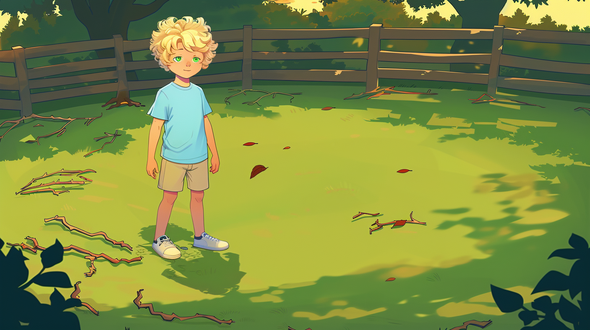

<div align="center">

<h2>Anim-Director: A Large Multimodal Model Powered Agent for Controllable Animation Video Generation </h2> 

 <b> SIGGRAPH Asia 2024 </b>
<!-- ## <b><font color="red"> TaleCrafter </font>: Interactive Story Visualization with Multiple Characters</b> -->


_**[Yunxin Li](https://yunxinli.github.io), [Haoyuan Shi](https://github.com/HaoyuanShi), Baotian Hu*, Longyue Wang*,<br>Jiashun Zhu, Jinyi Xu, Zhen Zhao, and Min Zhang**_
  
(* Corresponding Authors)

Harbin Institute of Technology, Shenzhen

🚀 Welcome to the repo of **Anim-Director**.

If you appreciate our project, please consider giving us a star ⭐ on GitHub to stay updated with the latest developments.  </h2>


<p align="center">  </p>
 
</div>


## 🎏 Abstract
<b>TL; DR: <font color="red">Anim-Director</font> is an autonomous animation-making agent where LMM interacts seamlessly with generative tools to create detailed animated videos from simple narratives.</b>

> Traditional animation generation methods depend on training generative models with human-labelled data, entailing a sophisticated multi-stage pipeline that demands substantial human effort and incurs high training costs. Due to limited prompting plans, these methods typically produce brief, information-poor, and context-incoherent animations. To overcome these limitations and automate the animation process, we pioneer the introduction of large multimodal models (LMMs) as the core processor to build an autonomous animation-making agent, named Anim-Director. This agent mainly harnesses the advanced understanding and reasoning capabilities of LMMs and generative AI tools to create animated videos from concise narratives or simple instructions. Specifically, it operates in three main stages: Firstly, the Anim-Director generates a coherent storyline from user inputs, followed by a detailed director’s script that encompasses settings of character profiles and interior/exterior descriptions, and context-coherent scene descriptions that include appearing characters, interiors or exteriors, and scene events. Secondly, we employ LMMs with the image generation tool to produce visual images of settings and scenes. These images are designed to maintain visual consistency across different scenes using a visual-language prompting method that combines scene descriptions and images of the appearing character and setting. Thirdly, scene images serve as the foundation for producing animated videos, with LMMs generating prompts to guide this process. The whole process is notably autonomous without manual intervention, as the LMMs interact seamlessly with generative tools to generate prompts, evaluate visual quality, and select the best one to optimize the final output. To assess the effectiveness of our framework, we collect varied short narratives and incorporate various Image/video evaluation metrics including visual consistency and video quality. The experimental results and case studies demonstrate the Anim-Director’s versatility and significant potential to streamline animation creation.

  
## ⚔️ Overview

<p align="center">  </p>
Given a narrative, Anim-Director first polishes the narrative and generates the director’s scripts using GPT-4. GPT-4 interacts with the image generation tools to produce the scene images through Image + Text → Image. Subsequently, the Anim-Director produces videos based on the generated scene images and textual prompts, i.e., Image + Text → Video. To improve the quality of images and videos, we realize deep interaction between LMMs and generative tools, enabling GPT-4 to refine, evaluate, and select the best candidate by self-reflection reasoning pathway.


## 🌈 Visual Example

<p align="center">  </p>
A visual example of Anim-Director.

## 🎨 Comparison 
<table class="center">
<tr>
  <td style="text-align:center;width: 33.33%"><b>DPT-T2I</b></td>
  <td style="text-align:center;width: 33.33%"><b>CustomDiffusion</b></td>
  <td style="text-align:center;width: 33.33%"><b>Anim Director (Ours)</b></td>
</tr>
<tr>
  <td></td>
  <td></td>
  <td></td>
</tr>
<tr>
  <td colspan="3" align="center">Scene #1: Tim stands with an earnest look, facing Tim's mother who is kneeling and focused on her gardening.</td>
</tr>
<tr>
  <td></td>
  <td></td>
  <td></td>
</tr>
<tr>
  <td colspan="3" align="center">Scene #2: Tim is holding a red round ball with a smile under a tree, surrounded by vibrant green grass.</td>
</tr>
<tr>
  <td></td>
  <td></td>
  <td></td>
</tr>
<tr>
  <td colspan="3" align="center">Scene #3: Tim sets the red round ball aside and looks onwards, the big oak's wide shadow covering him.</td>
</tr>
<tr>
  <td></td>
  <td></td>
  <td></td>
</tr>
<tr>
  <td colspan="3" align="center">Scene #4: Tim stands amidst dazzling flowers and looks around, holding a green rectangular shovel.</td>
</tr>
<tr>
  <td></td>
  <td></td>
  <td></td>
</tr>
<tr>
  <td colspan="3" align="center">Scene #5: Tim puts down the rectangular shovel and continues his search around the colorful flowers.</td>
</tr>
<tr>
  <td></td>
  <td></td>
  <td></td>
</tr>
<tr>
  <td colspan="3" align="center">Scene #6: Tim walks from the colorful flowers to the old swing set.</td>
</tr>
<tr>
  <td></td>
  <td></td>
  <td></td>
</tr>
<tr>
  <td colspan="3" align="center">Scene #7: Tim carefully navigates through thick grass around the faded old swing set.</td>
</tr>
<tr>
  <td></td>
  <td></td>
  <td></td>
</tr>
<tr>
  <td colspan="3" align="center">Scene #8: Tim finds the blue toy car under leaves near the old swing set, his face lighting up with joy.</td>
</tr>
<tr>
  <td></td>
  <td></td>
  <td></td>
</tr>
<tr>
  <td colspan="3" align="center">Scene #9: Tim is preparing to return to his yard with the blue toys he found.</td>
</tr>
<tr>
  <td></td>
  <td></td>
  <td></td>
</tr>
<tr>
  <td colspan="3" align="center">Scene #10: Tim is immersed in play in the cluttered yard, the blue toy car is put into the yard.</td>
</tr>
</table>


## 🌰 More Examples

<div align="center">
<video src="https://github.com/user-attachments/assets/6bce4aa8-716a-470d-9670-5c69779f178a" controls="controls" width="500" height="300"></video>
<b>A compressed version of generated <a href="https://github.com/HITsz-TMG/Anim-Director/blob/9a7e7bd6e4ada44eaeabeed6f3bd173bf2a1dd19/assets/demos/videos/demo1.mp4">Demo 1</a>.</b>
</div>
<div align="center">
<video src="https://github.com/user-attachments/assets/40324268-96a9-46e7-a649-f5fd55746022" controls="controls" width="500" height="300"></video>
<b>A compressed version of generated <a href="https://github.com/HITsz-TMG/Anim-Director/blob/9a7e7bd6e4ada44eaeabeed6f3bd173bf2a1dd19/assets/demos/videos/demo2.mp4">Demo 2</a>.</b>
</div>
<div align="center">
<video src="https://github.com/user-attachments/assets/4d89c602-1caa-41b4-81ac-2c1915617426" controls="controls" width="500" height="300"></video>
<b>A compressed version of generated <a href="https://github.com/HITsz-TMG/Anim-Director/blob/9a7e7bd6e4ada44eaeabeed6f3bd173bf2a1dd19/assets/demos/videos/demo3.mp4">Demo 3</a>.</b>
</div>


## ⚡️ Usage

<details>
  <summary><h3>Attention</h3></summary>  

Midjourney and Pika are paid, while Stable Diffusion 3 and PIA are free. If you want to achieve the animation generation effect shown in our paper and demo, please choose Midjourney for T2I and Pika for (T+I)2V.   
Welcome to contact us for more details (including how to integrate Pika into our agent).

</details>

<details>
  <summary><h3>Setup</h3></summary>
<h4>Prepare Environment</h4>

```bash
conda create -n AnimDirector python==3.10.11
conda activate AnimDirector
pip install -r requirements.txt
```
To use Stable Diffusion 3 for T2I, you need to upgrade your torch version along with all related packages.

<h4>Prepare Checkpoints For PIA</h4>
To use PIA for (T+I)2V, you need to prepare the following checkpoints.
<li>Download the Stable Diffusion v1-5</li>

```bash
conda install git-lfs
git lfs install
git clone https://huggingface.co/runwayml/stable-diffusion-v1-5 models/StableDiffusion/
```
<li>Download PIA</li>

```bash
git clone https://huggingface.co/Leoxing/PIA models/PIA/
```
<li>Download Personalized Models</li>

```bash
bash download_bashscripts/2-RcnzCartoon.sh
```
<h4>Prepare stable-diffusion-webui</h4>

To use MJ for T2I, you need to prepare stable-diffusion-webui following instructions [Here](https://github.com/AUTOMATIC1111/stable-diffusion-webui).   
After that, run:

```bash
bash code/StableDiffusion/webui.sh --nowebui
```

<h4>Prepare Imgur API</h4>

Sign up for an Imgur account.   
Obtain your Imgur client_id, client_secret, access_token, refresh_token following instructions [Here](https://github.com/Imgur/imgurpython).
</details>

<details>
  <summary><h3>Inference for scripts generation</h3></summary>
Run the following command to get the scripts:

```python
python code/script_gen.py
```
- The generated scripts will be saved as ```code/result/scripts.json```.
</details>

<details>
  <summary><h3>Inference for T2I with Midjourney </h3></summary>

Since Midjourney does not provide official API services, we use a third-party API platform [GoAPI](https://www.goapi.ai) for mj_api_key.   
Run the following command to get the (T+I)2V results:

```python
python code/image_gen_mj.py
```
- The generated images will be saved in ```code/result/image/mj```.
</details>

<details>
  <summary><h3>
  Inference for T2I with Stable Diffusion 3
  </h3></summary>
Run the following command to get the (T+I)2V results:

```python
python code/image_gen_pia.py
```
- The generated images will be saved in ```code/result/image/sd3```.
</details>

<details>

  <summary><h3>
  
  Inference for (T+I)2V with with PIA
  </h3></summary> 
Run the following command to get the (T+I)2V results:

```python
python code/video_gen.py
```
- The generated videos will be saved in ```code/result/video```.
</details>


## Citation
```bib
@misc{li2024animdirector,
      title={TaleCrafter: Interactive Story Visualization with Multiple Characters}, 
      author={Yunxin Li and Haoyuan Shi and Baotian Hu and Longyue Wang and Jiashun Zhu and Jinyi Xu and Zhen Zhao and Min Zhang},
      year={2024},
}
```
